# Este tutorial mostra como criar um Bucket no Google

Isso servirá para você salvar arquivos, como imagens e vídeos, podendo recuperá-los no frontend da sua aplicação. Esse tutorial explora a camada gratuita do Google e está sendo montado em especial para o projeto de rede social meu.

## Configuração do buckets do Google

Acesse o endereço do [console.cloud.google.com](https://console.cloud.google.com/cloud-resource-manager?folder=&organizationId=0&hl=pt-br) e crie sua conta. Sim, você precisará de um cartão de crédito, mas você não será cobrado na camada gratuita.

### Passo a passo
1. Crie um projeto, espere um pouco e depois atualize a página
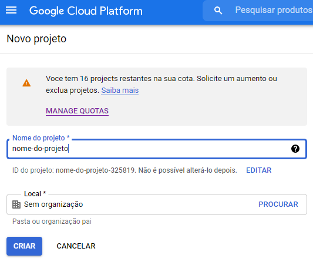

2. Volte na página inicial, você verá algo parecido com isso
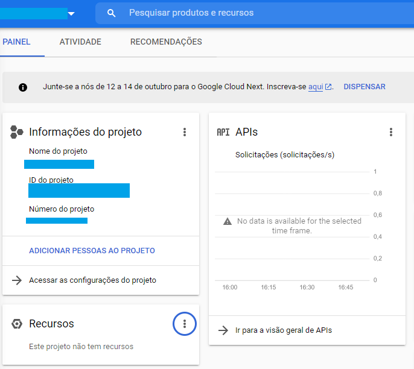

3. Na barra superior de busca, procure pelo 'Cloud Storage'
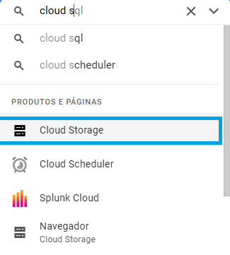

4. Crie um Bucket
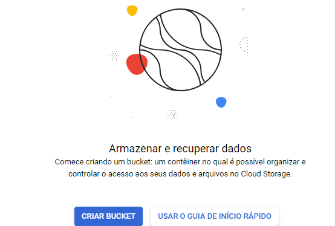

5. De um nome ao Bucket
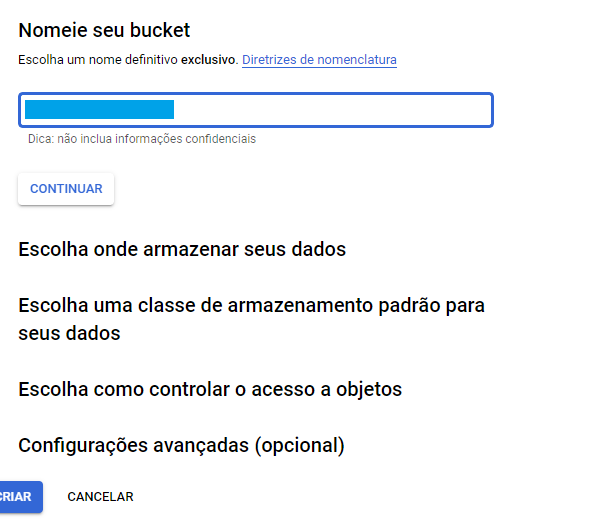

6. Pode manter as opções padrões
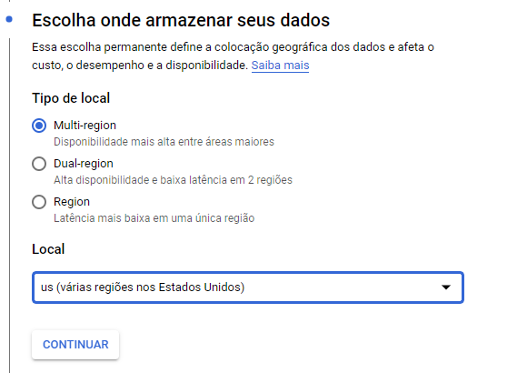

7. Continue com as opções padrões
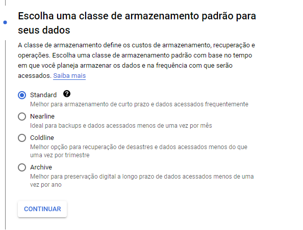

8. Desative a opção para aplicar prevenção a acesso público ao bucket
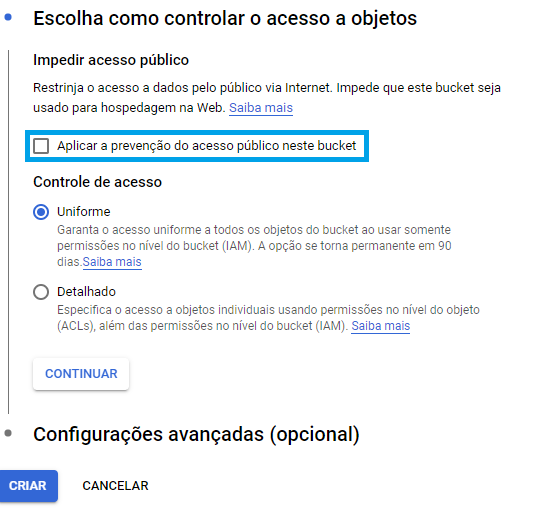

9 - Com o bucket criado, clique em 'Intervalos' e depois no bucket, clique nos três pontinhos e escolha a opção 'Editar Permissões do bucket'
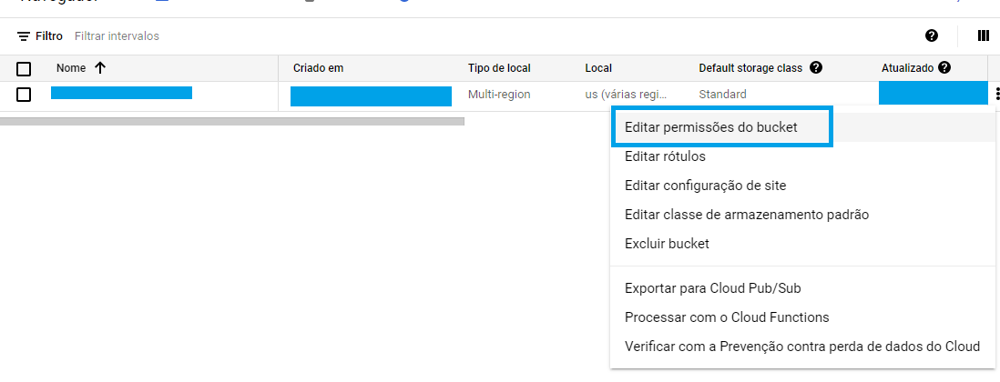

10. Adicione um principal, vamos tornar o acesso ao bucket publico
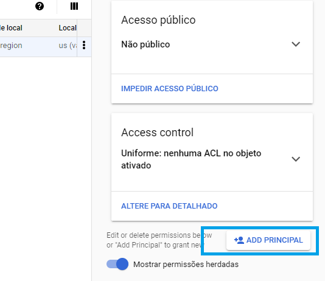

11 - Digite 'Allusers' no campo superior e clique em 'Selecionar Papel', escolhendo conforme o exemplo abaixo
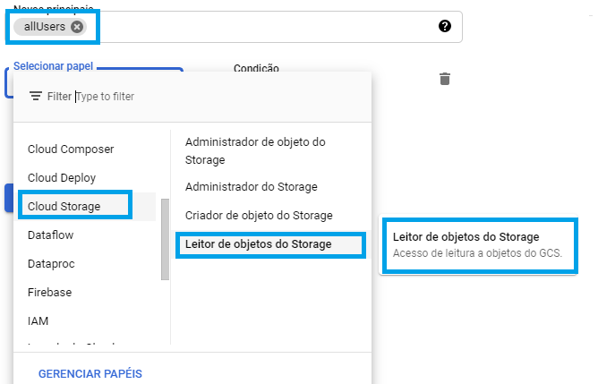

12 - Confirme a opção
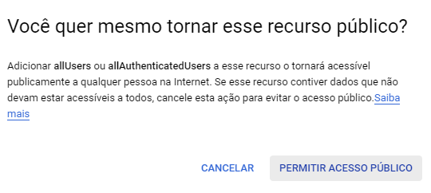

13 - Agora vamos obter as credenciais para acessar e manipularmos o bucket. Faça a busca por API Credenciais
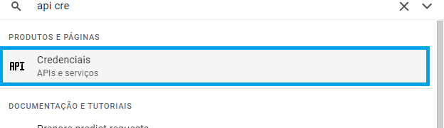

14 - Crie uma credencial como conta do serviço
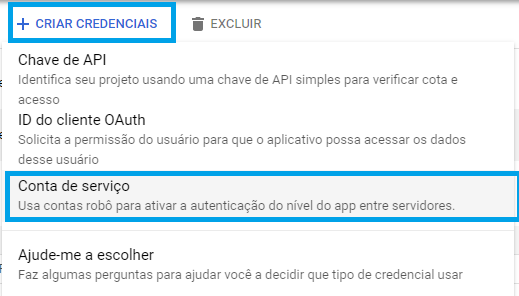

15 - Escolha o nome da conta de serviço
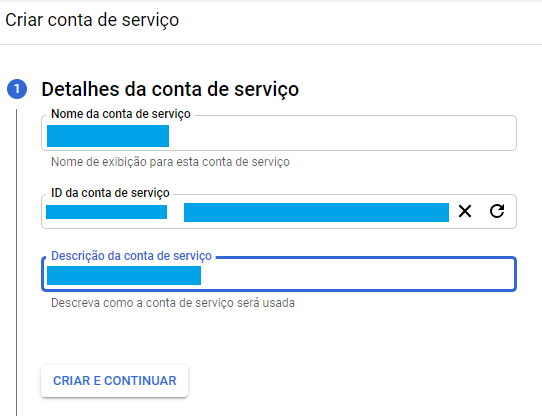

16 - Escolha a opção cloud storage, administrador do storage.
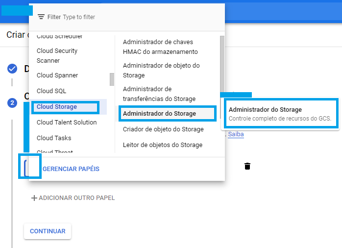

17. Pode deixar tudo em branco
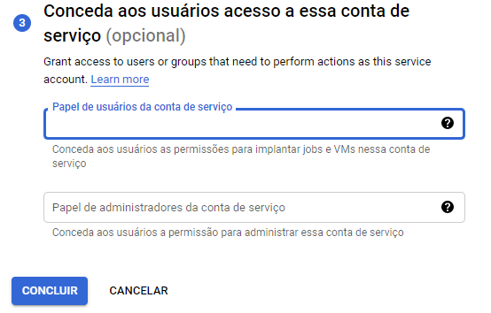

18 - Conta criada, clique nela
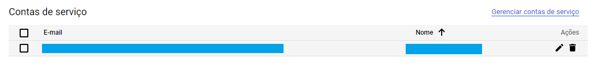

19 - Clique em adicionar a chaves
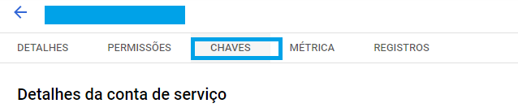

20 - Crie uma chave
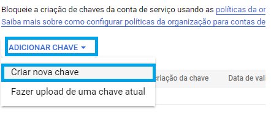

21 - Escolha a chave como Json
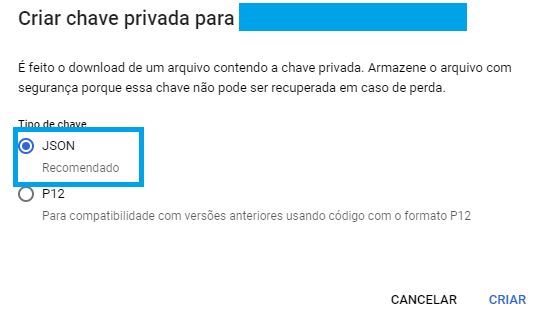

22 - Faça o download da chave json.
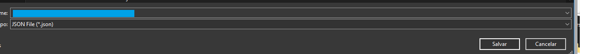

Portinho, bucket criado e pronto para o básico
